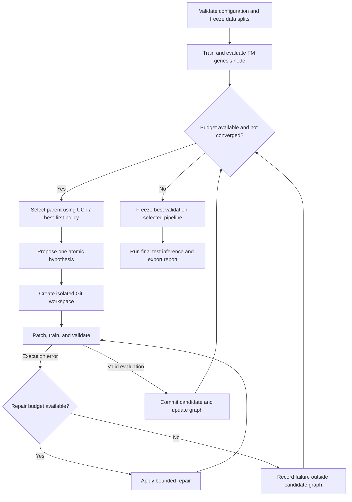

# Recommender Workshop

**Autonomous tree-search ML research for recommender systems.**

Recommender Workshop is designed to explore, optimize, and evaluate deep ranking pipelines on the **KuaiRand-Pure** short-video recommendation benchmark. It treats experimentation as a directed acyclic state graph: each accepted node is a runnable, evaluated pipeline pinned to a Git commit, and each edge records an atomic, hypothesis-driven change.

The goal is to automate the research loop—from feature engineering and model design to execution repair and final test inference—within a fixed experiment and time budget.

> **Status: design stage.** This repository currently documents the intended architecture and evaluation protocol. The agent, training pipelines, and runnable commands are not implemented yet. No benchmark results are claimed.

## Research objective

Rank items within logged user impressions for the primary **`long_view`** target, improving over a fixed **Factorization Machine (FM)** reference baseline.

The project defines its primary validation objective as:

\[
\mathrm{Primary} = \frac{\mathrm{GAUC} + \mathrm{nDCG@5}}{2}
\]

| Constraint | Target |
| --- | --- |
| Dataset | KuaiRand-Pure |
| Primary prediction target | `long_view` |
| Reference model | Fixed FM baseline |
| Search budget | At most 50 candidate iterations |
| Wall-clock budget | At most 6 hours per end-to-end run |
| Convergence parameters | Improvement threshold ε = 0.002; patience N = 3 |
| Human intervention | None after configuration and launch |

The dataset release, label derivation, impression grouping, split boundaries, GAUC weighting, and nDCG eligibility rules must be fixed before experiments begin. The score above is the project's specified objective; equivalence to an official benchmark protocol remains to be verified.

## Architecture



### Evaluated pipeline graph

Each accepted node should retain its commit hash, parent reference, hypothesis, configuration, random seeds, validation metrics, resource usage, and artifact references. Edges identify the subsystem changed and the evidence motivating that change.

Only runnable candidates with valid evaluations enter the graph. Failed attempts remain in a separate experiment ledger so that execution errors do not create invalid pipeline states. Valid candidates that underperform remain useful evidence, even when their branches are no longer expanded.

### Parent selection and pruning

A hybrid **Upper Confidence Bound for Trees (UCT) / best-first** policy balances high validation scores with exploration of less-visited branches. The search backtracks when a branch plateaus and prunes unproductive expansion paths while preserving their history.

The precise selection formula, exploration coefficient, reward normalization, and pruning rules are implementation decisions that must be recorded in the run configuration.

### Git isolation and persistent memory

Each candidate transformation runs on an ephemeral branch in an isolated workspace based on its selected parent's commit. Dataset splits remain read-only; checkpoints and other bulky artifacts live outside Git and are referenced by the experiment ledger.

Search state, failure caches, and cross-branch insights persist outside candidate workspaces. Hypothesis records should include their configuration and data context so that the agent can avoid repeating refuted experiments without incorrectly rejecting a hypothesis under materially different conditions.

### Bounded self-repair

Runtime exceptions, tensor shape mismatches, and CUDA out-of-memory errors trigger a bounded repair loop. Repairs and their outcomes are logged, and retries consume the same wall-clock budget as the rest of the run.

A candidate that exhausts its repair allowance is recorded as failed. Repair must not silently change frozen data splits, evaluation rules, or the primary target to obtain a passing run.

## Search space

| Subsystem | Candidate transformations |
| --- | --- |
| Feature engineering | Out-of-fold historical response rates, temporal features, and feature crosses |
| Model backbone | FM extensions, DeepFM, DLRM, and attention-based architectures |
| Multi-task learning | Auxiliary `click`, `like`, `comment`, and `play_time` signals supporting the `long_view` head |
| Loss formulation | Ranking-aware, listwise, and counterfactual objectives |

Each experiment should test one explicit hypothesis within a subsystem. Auxiliary labels and derived features require checks against the selected dataset schema. Counterfactual objectives require justified exposure or propensity assumptions; they should not be enabled solely because interaction logs are available.

## Evaluation and stopping protocol

1. **Freeze the benchmark.** Record the dataset version, split manifest, preprocessing rules, target definition, ranking groups, metric implementation, seeds, and hardware. Keep test data out of search decisions.
2. **Establish the reference.** Train and evaluate the fixed FM pipeline to create the genesis node. All candidates use the same evaluation protocol.
3. **Search on validation data.** Log both component metrics, Primary, the improvement over FM, execution status, and elapsed time for every evaluated candidate.
4. **Enforce all limits.** Stop when the iteration cap, wall-clock deadline, or convergence condition is reached, whichever comes first. Failed candidates count toward the iteration cap; repairs stay within their candidate's iteration and have a separate retry bound.
5. **Select and freeze.** Choose the best valid pipeline by validation Primary before accessing the test set. If no candidate improves on FM, retain the reference pipeline.
6. **Run final inference.** Export test predictions and, where labels are available, final test metrics without using them for further tuning.

**Proposed convergence interpretation:** compare the best-so-far validation Primary at the start and end of each candidate iteration. An improvement below 0.002 increments a patience counter; an improvement of at least 0.002 resets it. Stop after three consecutive below-threshold iterations. Failed attempts provide no improvement. This operational definition should be confirmed and frozen before implementation.

The six-hour budget covers initialization, baseline training, search, repairs, and final inference. The scheduler must reserve time for final inference and artifact export, and enforce timeouts on running jobs rather than checking the deadline only between experiments. If the run cannot complete, it must report that limitation explicitly.

## Planned run artifacts

- A searchable experiment ledger and pipeline graph with commit references.
- Per-candidate hypotheses, configurations, metrics, logs, and failure or repair histories.
- A persistent cache of prior hypotheses and cross-branch findings.
- The selected pipeline's configuration, checkpoint references, and test predictions.
- A final report comparing the selected pipeline with FM, documenting resource use, stopping reason, and reproducibility details.

## Implementation roadmap

- [ ] Specify and validate the KuaiRand-Pure data and metric contract.
- [ ] Implement the fixed FM baseline and reproducible evaluation harness.
- [ ] Add the experiment ledger, pipeline graph, and Git workspace lifecycle.
- [ ] Implement parent selection, hypothesis generation, backtracking, and pruning.
- [ ] Add bounded execution repair, failure caching, and resource enforcement.
- [ ] Integrate feature, backbone, multi-task, and loss transformations.
- [ ] Implement convergence checks, final selection, test inference, and reporting.
- [ ] Validate a complete autonomous run under the 50-iteration and six-hour limits.

## Getting started

### Repository and workspace layout

```text
agent/                         # Tracked autonomous agent engine
workspace_template/            # Tracked starting pipeline; currently empty stubs
    features.py
    model.py
    train.py
    evaluate.py
workspace/                     # Ignored independent Git repository for experiments
storage/                       # Persistent search memory outside the inner repository
data/kuairand-pure/starter-kit/ # Tracked reference code and English documentation
data/kuairand-pure/KuaiRand-Pure/data/ # Ignored raw dataset
checkpoints/                   # Ignored generated weights and predictions
```

The outer repository versions the agent and starting template. The inner `workspace/` repository versions evolving candidate pipelines independently; it is not a submodule and its files are not tracked by the outer repository.

The planned initializer copies `workspace_template/` into a new workspace, initializes its Git repository, and creates a genesis scaffold commit. That commit is not an evaluated search node until the baseline has run successfully. Subsequent runs resume the existing workspace without overwriting files or resetting its history. An existing directory that is not an initialized workspace must be reported rather than silently replaced. Template updates apply only to newly initialized workspaces.

The template's `evaluate.py` is currently empty. Its eventual role is to call the fixed reference harness outside the editable workspace; the agent must not evolve the benchmark scoring rules. The template contains no data, checkpoints, or Git metadata. Initialization logic is not implemented yet.

There is no runnable entry point yet. Installation instructions, dependency versions, dataset preparation commands, and launch examples will be added alongside the implementation. The first implementation milestone is a reproducible FM baseline with a frozen evaluation contract.
