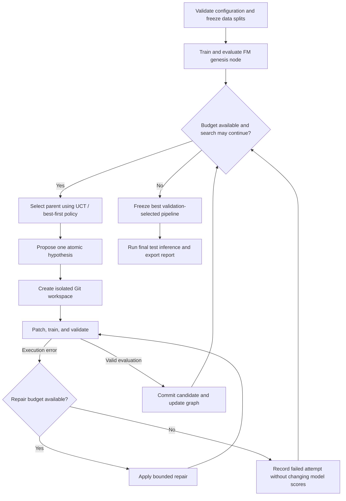

# Recommender Workshop

**Autonomous tree-search ML research for recommender systems.**

Recommender Workshop is designed to explore, optimize, and evaluate deep ranking pipelines on the **KuaiRand-Pure** short-video recommendation benchmark. It treats experimentation as a directed acyclic state graph: each accepted node is a runnable, evaluated pipeline pinned to a Git commit, and each edge records an atomic, hypothesis-driven change.

The goal is to automate the research loop—from feature engineering and model design to execution repair and final test inference—within a fixed experiment and time budget.

> **Status: integrated implementation.** The sequential orchestrator connects proposal, mutation, execution, repair, tree search, memory, reflection, and reporting. Offline lifecycle tests and a real-training smoke test with mocked model responses pass. A full-budget live-model search and independent verification of the starter-kit benchmark protocol remain outstanding.

## Research objective

Rank items within logged user impressions for the primary **`long_view`** target, improving over a fixed **Factorization Machine (FM)** reference baseline.

The project defines its primary validation objective as:

\[
\mathrm{Primary} = \frac{\mathrm{GAUC} + \mathrm{nDCG@5}}{2}
\]

| Constraint | Target |
| --- | --- |
| Dataset | KuaiRand-Pure |
| Primary prediction target | `long_view` |
| Reference model | Fixed FM baseline |
| Search budget | At most 50 candidate iterations |
| Wall-clock budget | At most 6 hours per end-to-end run |
| Default search policy | Best-first; after 5 evaluated non-improvements, one detour of up to 2 attempts |
| Human intervention | None after configuration and launch |

The dataset release, label derivation, impression grouping, split boundaries, GAUC weighting, and nDCG eligibility rules must be fixed before experiments begin. The score above is the project's specified objective; equivalence to an official benchmark protocol remains to be verified.

## Architecture



### Evaluated pipeline graph

Each accepted node should retain its commit hash, parent reference, hypothesis, configuration, random seeds, validation metrics, resource usage, and artifact references. Edges identify the subsystem changed and the evidence motivating that change.

The tree registry retains pending, running, successful, failed, and pruned attempts. Only successful, unpruned pipelines are eligible for expansion. Failed attempts remain in the registry for budget and reward accounting without becoming eligible pipeline states. Valid candidates that underperform remain useful evidence, even when their branches are no longer expanded.

### Parent selection and pruning

New runs default to **best-first with bounded detours** (`strategy="best_first"`).
The tree records ancestry, while parent selection considers a flat pool of
evaluated models. Usually select the model with the highest own validation
Primary; promote any strictly higher score immediately and retain the incumbent
on ties. There is no child cap, forced expansion, or subtree pruning. Lower
scores remain in the archive, and failed implementations do not lower parent
scores or add zero-reward visits.

After `stagnation_patience=5` successfully evaluated candidates without a new
global best, start a detour. Prefer the highest-scoring alternative outside the
incumbent's ancestor/descendant chain; if none exists, use the highest-scoring
distinct checkpoint elsewhere in the archive. Equal scores retain insertion
order; identical incumbent commit hashes are excluded. Ancestry is a cheap
diversity proxy, **not an architecture classifier**. The detour has at most
`detour_attempts=2` attempts, including failed implementations. Its next attempt
builds on its latest valid candidate even if that candidate is worse than its
parent or the global best; a failed attempt leaves the detour parent unchanged.
A global improvement ends the detour immediately and returns to best-first.

An unsuccessful detour stops search with `stop_reason="stagnation"` for review;
it does not automatically restart. At most `max_detours=1` detour may start per
run by default, including successful detours. If that allowance is used, the
next best-first stagnation also stops. `max_detours=0` disables detours. No valid
alternative means stop rather than fabricate another model. Hard iteration,
model-call and time limits may cut a detour short. The five-evaluation window
ignores implementation failures, but all attempts still consume the hard budgets.
These limits are spending guards, not evidence of mathematical convergence.

Search stopping uses the existing finalization flow: freeze the best model,
attempt final test inference within the reserved budget, and write the report.
It does not authorize another run. Any higher validation score counts as a
selection improvement; this is not a statistical-significance claim.

**Legacy UCT** remains available with `strategy="uct"`. It uses backed-up mean
Primary plus `c * sqrt(log(parent_visits) / visits)`, default `c=sqrt(2)`, and
counts failures as zero-reward visits. It fills three child-attempt slots before
descending, prunes parent-relative drops greater than 0.01, and retains its old
convergence rule. `exploration_weight`, `max_children`, `prune_delta`, `patience`,
and `improvement_threshold` affect UCT only. Genesis remains outside the candidate
budget, and both policies permit one active attempt.

Version-2 tree checkpoints persist and validate detour state by replaying
allocation history. Version-1 checkpoints and saved run configs without a
strategy load as UCT; resuming never silently changes the policy. Use a fresh
run to change strategy. The original implementation is also preserved on local
branch `codex/uct-search-preserved` at `fff7aac`.

`selection.chosen` events and `report.json`'s `selection_decisions` explain each
parent choice. The same allocation context is supplied to the proposal model.
Run the allocation tests without model calls using
`python -B scripts/test_best_first.py`; `python -B scripts/test_tree.py` checks
legacy UCT compatibility.

### Git isolation and persistent memory

Each candidate transformation runs on an ephemeral branch in an isolated workspace based on its selected parent's commit. Dataset splits remain read-only; checkpoints and other bulky artifacts live outside Git and are referenced by the experiment ledger.

Search state, failure caches, and cross-branch insights persist outside candidate workspaces. Hypothesis records should include their configuration and data context so that the agent can avoid repeating refuted experiments without incorrectly rejecting a hypothesis under materially different conditions.

`ExplorationMemory` in `agent/graph/memory.py` records terminal outcomes through `record(node, parent, context, stderr=..., reflection=...)`. Supply a `MemoryContext` with run ID, evaluation protocol ID, subsystem, and relevant configuration/shapes/seeds. Numeric gains and losses are relative to the parent; neutral results are retained, and pruning status does not determine whether an experiment improved. Terminal failures require an error signature and the final ten stderr lines. All terminal outcomes can carry optional reflections under 20 words, labelled as model interpretations without replacing numeric or error evidence. Memory never calls an LLM or applies reflection thresholds. The orchestrator gates reflection on significant parent-relative gains/losses or terminal failures, subject to remaining budgets; pruning alone is not a trigger. Routine iterations need only numeric summaries. Diagnostic text is bounded and redacted before it is supplied to memory or an LLM.

`prompt_summary(context)` selects up to six contextual insights with a 2,400-character cap, excludes other evaluation protocols, and deduplicates equivalent observations for the prompt without deleting evidence. Pass `max_tokens` and the target model's `token_counter` for a token cap on the complete summary. `save()` and `load()` use versioned `storage/global_insights.json` with atomic replacement and validation. Prompt assembly and recording remain explicit orchestrator responsibilities; they are not automatically wired into the mutation engine. Run offline checks with `python scripts/test_memory.py`.

### Post-evaluation reflection

`agent/graph/reflection.py` provides `ReflectionEngine`, separate from improvement
selection and memory storage. After a candidate completes, the orchestrator may
request a tentative interpretation of its hypothesis, diff, parent/child metrics,
configuration context, repairs, and final failure diagnostics:

```python
from agent.graph.reflection import ReflectionEngine

reflection = ReflectionEngine(client).reflect(node, parent, memory_context, stderr=redacted_stderr)
memory.record(node, parent, memory_context, stderr=redacted_stderr, reflection=reflection)
```

Use empty stderr for evaluated candidates and redacted final stderr for failures
after repair exhaustion. Reflection returns fewer than 20 words, or `None` when
unavailable, declined, truncated, or malformed. Provider/configuration failures
do not prevent recording the original outcome; invalid caller evidence raises
before a model request. Record once after reflection, since memory rejects
conflicting records for the same run/node. Reflection does not modify nodes or
persistent memory. The orchestrator still owns significance thresholds,
scheduling, redaction, context size, and run-wide time/token budgets; pruning
alone is not a trigger. Tests: `python -B scripts/test_reflection.py`.

### Improvement selection

`agent/improvement/` chooses one concrete change before code mutation. Categories
are not required. `ImprovementEngine.propose()` takes the current editable source
snapshot, the full genesis-to-current lineage (including edge diffs and results),
an objective, and frozen constraints. Optional context can include configuration,
sibling attempts, cross-branch memory, and remaining budgets. It returns a requirement
string directly consumable by `CodeMutationEngine`:

```python
from agent.improvement import ImprovementEngine
from agent.mutation.mutation import CodeMutationEngine

requirement = ImprovementEngine(client).propose(
    files,
    tree.get_lineage_chain(parent.node_id),
    objective="Improve validation Primary within the remaining experiment budget.",
    constraints="Keep data splits, target, metrics, and test isolation unchanged.",
    context=context_summary,
)
updated_files = CodeMutationEngine(client).mutate(requirement, files)
```

The caller supplies these variables and is responsible for source/commit
correspondence, context size, redaction, and budget enforcement. Proposal output
is validated structurally; its scientific merit and compliance still require
review/evaluation by the execution layer. Caller constraints are preserved in
the returned requirement. Neither proposal nor mutation executes code or writes
files. The orchestrator connects these stages. Run offline checks with
`python -B scripts/test_improvement.py`.

### Bounded self-repair

`agent/recovery/` implements one bounded repair session per candidate. It calls
the existing mutation engine with the original hypothesis, frozen constraints,
and caller-redacted diagnostics. Each valid request consumes an attempt,
including provider errors, invalid edits, and `NO_CHANGES`. Invalid caller inputs
consume no attempt. Provider/edit errors propagate after a failed event is recorded.

```python
from agent.recovery import RecoveryEngine

recovery = RecoveryEngine(mutation, max_attempts=3, history=node.recovery_events)
proposal = recovery.propose(
    files, hypothesis=hypothesis, diagnostics=redacted_diagnostics,
    constraints=frozen_constraints,
)
if proposal is not None:
    # The orchestrator writes proposal.files, runs validation, then reports:
    recovery.record_result(succeeded=execution_and_evaluation_succeeded)
node.recovery_events = recovery.events
```

The variables and execution step above are supplied by the caller. A pending
proposal must be resolved before another request; successful repair closes the
session. `RecoveryExhausted` signals that no more proposals are allowed. Each
completed event retains that repair's diff and triggering diagnostics; token
usage is unknown because mutation currently returns only files. Global deadlines,
checkpoint compatibility, diagnostic redaction, and persistence remain caller
responsibilities. Completed history can be restored; an interrupted pending
proposal is reconciled by the orchestrator before resuming. Tests:
`python -B scripts/test_recovery.py`.

Runtime exceptions, tensor shape mismatches, and CUDA out-of-memory errors trigger a bounded repair loop. Repairs and their outcomes are logged, and retries consume the same wall-clock budget as the rest of the run.

A candidate that exhausts its repair allowance is recorded as failed. Repair must not silently change frozen data splits, evaluation rules, or the primary target to obtain a passing run.

## Search space

| Subsystem | Candidate transformations |
| --- | --- |
| Feature engineering | Out-of-fold historical response rates, temporal features, and feature crosses |
| Model backbone | FM extensions, DeepFM, DLRM, and attention-based architectures |
| Multi-task learning | Auxiliary `click`, `like`, `comment`, and `play_time` signals supporting the `long_view` head |
| Loss formulation | Ranking-aware, listwise, and counterfactual objectives |

Each experiment should test one explicit hypothesis within a subsystem. Auxiliary labels and derived features require checks against the selected dataset schema. Counterfactual objectives require justified exposure or propensity assumptions; they should not be enabled solely because interaction logs are available.

## Evaluation and stopping protocol

1. **Freeze the benchmark.** Record the dataset version, split manifest, preprocessing rules, target definition, ranking groups, metric implementation, seeds, and hardware. Keep test data out of search decisions.
2. **Establish the reference.** Train and evaluate the fixed FM pipeline to create the genesis node. All candidates use the same evaluation protocol.
3. **Search on validation data.** Log both component metrics, Primary, the improvement over FM, execution status, and elapsed time for every evaluated candidate.
4. **Enforce all limits.** Stop when a hard budget or the policy's stopping condition is reached. Failed candidates count toward the iteration cap; repairs stay within their candidate's iteration and have a separate retry bound.
5. **Select and freeze.** Choose the best valid pipeline by validation Primary before accessing the test set. If no candidate improves on FM, retain the reference pipeline.
6. **Run final inference.** Export test predictions and, where labels are available, final test metrics without using them for further tuning.

**Legacy UCT convergence only:** compare best-so-far validation Primary now with its value three completed candidate iterations earlier. Stop if the total improvement across that window is at most 0.002; continuing requires strictly more than 0.002. Failed attempts count as iterations with no improvement. The comparison uses an absolute tolerance of 1e-12 at the threshold. Best-first instead uses the stagnation/detour rules above. Hard budgets apply independently to both policies.

The six-hour budget covers initialization, baseline training, search, repairs, and final inference. The scheduler must reserve time for final inference and artifact export, and enforce timeouts on running jobs rather than checking the deadline only between experiments. If the run cannot complete, it must report that limitation explicitly.

## Run artifacts

`agent/reporting/` builds a deterministic JSON report with the genesis/selected
validation comparison, parent-relative candidate results, failures, repairs,
artifact references, stop reason, and separately supplied final test results.
`build_report(tree, selected_node_id=..., stop_reason=..., artifacts=...,
final_test=...)` does not select a pipeline or run inference. Optional
`FinalTestResult` must refer to the selected node; omitted test results are marked
`not_run`. `write_report(report, path)` exports JSON atomically. Artifact paths are
indexed without copying or checking the files. Caller-supplied diagnostics must
be redacted. Tests: `python -B scripts/test_reporting.py`.

- A searchable experiment ledger and pipeline graph with commit references.
- Per-candidate hypotheses, configurations, metrics, logs, and failure or repair histories.
- A persistent cache of prior hypotheses and cross-branch findings.
- The selected pipeline's configuration, checkpoint references, and test predictions.
- A final report comparing the selected pipeline with FM, documenting resource use, stopping reason, and reproducibility details.

## Implementation roadmap

- [ ] Specify and validate the KuaiRand-Pure data and metric contract.
- [x] Implement the fixed FM baseline and reproducible evaluation harness.
- [x] Add the experiment ledger, pipeline graph, and Git workspace lifecycle.
- [x] Implement parent selection, hypothesis generation, backtracking, and pruning.
- [x] Add bounded execution repair, failure evidence, and deadline checks.
- [ ] Integrate feature, backbone, multi-task, and loss transformations.
- [x] Implement convergence checks, final selection, test inference, and reporting.
- [ ] Validate a complete autonomous run under the 50-iteration and six-hour limits.

## Getting started

### Repository and workspace layout

```text
agent/
├── __init__.py
├── log.py                    # Shared structured storage/run_log.jsonl event logger
├── budget.py                 # Shared deadline, final reserve, bounded model calls
├── run_state.py              # Atomic checkpoint generations and process ownership
├── llm/
│   ├── __init__.py
│   ├── client.py              # LLM calls, token accounting, retries, model selection
│   └── mock_client.py         # Mock responses for offline testing
├── improvement/              # Select the next experiment from code and evidence
├── recovery/                 # Bounded repairs to the same hypothesis
├── reporting/                # Final JSON report and artifact index
├── mutation/
│   ├── __init__.py
│   ├── mutation.py            # Implement a supplied requirement
│   ├── parser.py              # Exact search/replace parsing
│   └── prompts.py             # Prompt templates and output format rules
├── graph/
│   ├── __init__.py
│   ├── node.py                # SearchNode, EdgeAction, MetricResult
│   ├── tree.py                # Selection, pruning, serialization
│   ├── memory.py              # Contextual experiment evidence
│   └── reflection.py          # Optional post-evaluation interpretation
├── sandbox/
│   ├── __init__.py
│   ├── git_driver.py          # Inner repository lifecycle
│   ├── environment.py         # Candidate dependency environments and cache
│   ├── protocol.py            # Fixed data loader and evaluator access
│   ├── worker.py              # Isolated candidate entry point
│   ├── lease.py               # Process-held execution leases
│   └── runner.py              # Training and evaluation subprocesses
└── orchestrator.py            # Search loop and resource limits
workspace_template/           # Editable pipeline modules passed in LLM context
├── features.py               # Feature extraction, item/user stats, embedding encoders
├── model.py                  # Neural / tabular architecture (FM, DeepFM, DCN)
├── train.py                  # Training loop, optimizer, loss, checkpoint saving
├── config.py                 # Hyperparameters: learning rate, batch size, embedding dims
└── requirements.txt          # Candidate's pinned runtime dependencies
workspace/                    # Ignored independent Git repo; same pipeline filenames
storage/                      # Ignored persistent outputs; .gitkeep is tracked
├── state_tree.json
├── run_log.jsonl
└── global_insights.json
data/kuairand-pure/            # Existing data layout preserved
├── starter-kit/              # Tracked fixed reference code and English README
└── KuaiRand-Pure/data/        # Ignored raw dataset; download separately below
checkpoints/                  # Ignored weights and predictions; .gitkeep is tracked
requirements.txt              # Agent/runner dependencies, not the candidate environment
main.py                       # Launch/resume CLI entry point
README.md
```

The outer repository versions the agent and starting template. The inner `workspace/` repository versions evolving candidate pipelines independently; it is not a submodule and its files are not tracked by the outer repository.

`GitDriver(workspace_dir="workspace").init_workspace("workspace_template")` copies the template into a new workspace, initializes its Git repository, and creates the `node_00: genesis` scaffold commit. It returns the current commit SHA. That commit is not an evaluated search node until the baseline has run successfully. Subsequent runs resume the existing workspace without overwriting files or resetting its history. A populated directory that is not an initialized workspace is reported rather than silently replaced. Template updates apply only to newly initialized workspaces. The driver copies all template files, including `baseline.py` when supplied by a starter kit, excluding Git metadata.

The driver uses the Git CLI through Python's `subprocess` module; Git must be installed and available on `PATH`, but GitPython is not required. It supports detached checkouts, branches rooted at explicit parent commits, UTF-8 source reads and atomic per-file writes, node commits, and unified diffs. Call `reset_hard()` and `clean_untracked()` explicitly before switching when edits should be discarded; ignored files are preserved by cleanup. Git failures propagate as `subprocess.CalledProcessError` with captured stderr. Run the isolated integration checks with `python scripts/test_git_driver.py`.

The editable template contains `features.py`, `model.py`, `train.py`, `config.py`, and `requirements.txt`, intended to be passed in LLM context together. They implement the reference FM and declare its dependencies. The module specifications are authoritative; implementations and dependency choices are replaceable. Fixed data loading and scoring are accessed through `agent/sandbox/protocol.py`, outside the editable pipeline; the agent must not evolve the benchmark scoring rules. The template contains no data, checkpoints, virtualenv, or Git metadata. Runtime storage files are ignored by the outer repository.

### Launch or resume a search

Run these commands in **PowerShell from the repository root**. The application
runs in the foreground; keep that terminal open. Live search sends candidate code
and experiment history to your configured providers and may incur API charges.

For first-time setup, install Git and Python, then create the root environment:

```powershell
python -m venv .venv
.\.venv\Scripts\python.exe -m pip install -r requirements.txt
if (-not (Test-Path .env)) { Copy-Item .env.example .env }
```

Skip installation if the existing `.venv` is ready. Activation is unnecessary:
all commands below use its Python executable directly. Fill in `LLM_HIGH_MODEL`
and `LLM_HIGH_API_KEY` for improvement, and `LLM_LOW_MODEL` and `LLM_LOW_API_KEY`
for mutation, repair, and reflection. Set the corresponding reasoning efforts
in `.env`; use provider/model IDs supported by LiteLLM. Provider API billing must
be funded. Never put credentials in the run config or commit `.env`.

The examples assume the prepared KuaiRand-Pure CSVs are at
`data/kuairand-pure/KuaiRand-Pure/data`; adjust `--data-dir` if yours are elsewhere.

**Three-iteration sample.** Create `storage` if needed (`New-Item -ItemType
Directory -Force storage`), and save this JSON as `storage/run-3.json`:

```json
{
  "search": {
    "strategy": "best_first",
    "max_iterations": 3,
    "max_wall_clock_s": 3600,
    "stagnation_patience": 5,
    "detour_attempts": 2,
    "max_detours": 1
  },
  "candidate_timeout_s": 1800,
  "final_reserve_s": 180,
  "max_repairs": 3,
  "proposal_attempts": 2,
  "mutation_attempts": 4,
  "proposal_tokens": 16384,
  "mutation_tokens": 8192,
  "max_llm_calls": 24,
  "reflection_enabled": true
}
```

Then start a fresh run:

```powershell
.\.venv\Scripts\python.exe -B main.py --run-dir storage/sample-3-001 --data-dir data/kuairand-pure/KuaiRand-Pure/data --config storage/run-3.json
```

This example uses the current best-first default; historical paid samples used UCT.
It evaluates genesis, attempts three candidates, and evaluates the selected
pipeline on the final test split. Safety limits can stop it early; failed
candidate attempts still count. The larger proposal cap leaves room for high
reasoning. `--config` accepts RunConfig fields and is optional for new runs.

**Watch progress from a second PowerShell terminal:**

```powershell
Get-Content storage/sample-3-001/events.jsonl -Tail 20 -Wait
```

The main terminal can be quiet during training/model calls. Events identify the
stage, node and diagnostics artifact. Full improvement outputs are in the
`model.response` artifacts for stage `propose`. Read `current.json` to locate
the newest snapshot; each node's `incoming_edge.hypothesis` in its `tree.json`
contains the selected requirement. When finished, read `report.json` for scores,
selected node, candidate outcomes, and artifact paths.

**Resume after fixing an error or stopping the process:**

```powershell
.\.venv\Scripts\python.exe -B main.py --run-dir storage/sample-3-001 --resume
```

Do not pass `--config` or `--data-dir` with `--resume`: saved run settings are
reused. Model profiles are read from the current environment. The original
wall-clock deadline still applies; paused time counts. Resume does not add
iterations to a completed run. Confirm the old process and its workers have
stopped before resuming; never delete lock files to force it.

**Refresh/start over:** use a new directory such as `storage/sample-3-002` with
the fresh-run command. This creates a new tree and memory while retaining the
old run. A populated directory is rejected for a new run. The orchestrator owns
its candidate workspace and may discard uncommitted edits there when restoring
stages; do not edit it during execution.

For a run with a 50-attempt ceiling, copy the sample config and set `max_iterations`
to 50, `max_wall_clock_s` to 21600, and `max_llm_calls` to 400. Keep
other settings as appropriate and choose another fresh run directory. These are
safety ceilings, not a guarantee that all 50 attempts will finish.
Best-first may stop much earlier after an unsuccessful detour; raising the
iteration ceiling does not raise the detour allowance.

Exit codes: `0` means final test evaluation succeeded (not necessarily a better
model); `1` means an exception stopped the run; `2` means the run finalized but
its final test did not succeed.

Defaults retain 50 candidates and six hours, with a 120-second finalization
reserve, 1,800-second limit per runner invocation, three repairs per candidate,
two proposal attempts, four initial mutation attempts (one try plus three
correction retries), and 200 logical model
calls. Default proposal/mutation output caps are 4,096/8,192 tokens; reflection
uses 128. Prompts exceeding 200,000 characters pause the run rather than silently
dropping history. Model calls are counted before dispatch; returned token usage
is accumulated separately and is not a hard total-token or dollar budget.
Transport retries and requests lost during interruption can still incur costs.

Each candidate counts even when no valid proposal or code change results; an
`unproposed` placeholder edge identifies proposal failures. No-change attempts
skip training. Repairs stay within the candidate and start fresh checkpoints
after code changes. Execution failures after repair exhaustion enter memory;
provider, Git, storage, data-loading, and dependency-provisioning failures pause
instead of being treated as negative ML evidence. Inspect local execution logs
before resuming. Invalid dependency pin syntax can be repaired automatically;
failed package installation requires resolving the provisioning issue first.

The orchestrator freezes a content fingerprint of the CSV inputs and evaluator,
and rejects changes on resume. This detects drift, not hostile candidate access;
the subprocess runner remains a trusted-code tool, not a security sandbox.
Diagnostic redaction covers configured/common credential forms but cannot
guarantee removal of arbitrary private text. Keep secrets out of candidate code.

Run outputs live under the chosen directory:

```text
current.json                 # Atomic pointer to a complete generation
snapshots/<id>/state.json     # Stage, configuration, attempts, artifact references
snapshots/<id>/tree.json      # Search tree (after successful genesis)
snapshots/<id>/memory.json    # Evidence and optional interpretations
workspace/                   # Owned independent Git repository
executions/<id>/              # Runner results, logs, and predictions
checkpoints/                 # Per-execution model checkpoints
events.jsonl                 # Structured orchestration and execution events
diagnostics/<id>.json        # Full redacted model outputs and error details
report.json                  # Final comparison, test result, and artifact index
```

Checkpoint events retain `event="stage.saved"` and include a `data.reason`:
`stage_entered`, `attempt_reserved`, `model_request_started`,
`model_response_received`, `candidate_committed`, or `execution_scheduled`.
Resume/error paths additionally use `candidate_restored`, `attempt_released`,
`execution_retry_prepared`, and `run_paused`. `attempt` is included when applicable
and identifies the stage-local attempt (proposal, mutation, repair, or reflection).
`call_id` connects each model request/response within the run; scheduled jobs also
include `execution_id`.

```json
{"event":"stage.saved","data":{"stage":"propose","node_id":"node_001","reason":"model_request_started","attempt":1,"call_id":1}}
```

Model-response checkpoints include `elapsed_s` for the client call (including its
transport retries, excluding checkpoint writes), `token_usage` with prompt,
completion, and total counts, and `finish_reason`. Missing usage/finish reason is
`null`; unfamiliar finish reasons are logged as `other`. A truncated response is
logged before parsing rejects it, making retries visible. No prompts, code,
response text, credentials, or raw provider exception messages are logged by
these checkpoint events. Older run logs are left unchanged.

Snapshots are retained, including unpublished generations left by interrupted
writes. A run-level process lease prevents concurrent orchestrators. Workers hold
a separate lease so source restoration refuses while a surviving worker is
active; after abrupt process termination, ensure leftover provisioning/worker
processes have exited before resuming. Do not delete lease files to bypass this.
Completed runner `result.json` files are reconciled without retraining; incomplete
executions may resume the same compatible checkpoint. Interrupted model calls
consume attempt allowances; interrupted optional reflection is skipped. Tree and
memory publish in the same checkpoint generation to prevent double accounting.

Best-pipeline selection uses validation only, including valid pruned nodes and
genesis fallback. The selected commit and checkpoint checksum are fixed before
test inference. A completed test result is reused on resume. If time expires,
the report explicitly records missing final inference. CLI exit codes are 0 for
successful final inference, 2 for a finalized run without it, and 1 for an error.

Provider timeouts and retry sleeps respect the shared remaining deadline, but
blocking native/provider operations, Git, hashing, data loading, scoring, and
state writes are not preempted by an OS watchdog. The reserve is a scheduling
allowance, not a guarantee that finalization can finish. Injected custom clients
must provide their own interruption behavior.

Checks (the first two require no model credentials or package downloads):

```powershell
python -B scripts/test_budget_state.py
python -B scripts/test_orchestrator.py
python -B scripts/test_orchestrator.py --real-runner
```

The last command uses the real FM, environment manager, subprocess runner, and
synthetic data with mocked model responses. It may provision pinned dependencies
if the environment is not cached; it does not make live LLM requests.

For the configured Gemini model, live testing found that default reasoning could
exhaust both 1,024- and 4,096-token proposal caps before producing a complete
answer. The then-supported shared setting `LLM_REASONING_EFFORT=low` returned a complete diagnostic proposal with
the 4,096-token cap. Set this optional environment variable (or `.env` entry) for
bounded Gemini runs; leave it blank for the provider default. Support varies by
provider/model. The parser accepts a single complete JSON code fence but still
rejects truncated responses and surrounding commentary.

A full-data live smoke run on 2026-08-30 with `gemini/gemini-3.5-flash` and
The then-supported shared setting `LLM_REASONING_EFFORT=low` completed one candidate in 135 seconds using two model
calls (11,851 reported tokens). Gemini proposed `k=8` and `l2=1e-4`; mutation and
training succeeded without repairs. Candidate validation Primary was 0.599926
versus genesis 0.601469, so genesis was retained. Final test Primary was 0.595341.
This verifies the live integration, not an improvement or a full-budget search.

### Train, evaluate, and recover a candidate

Install the root `requirements.txt` for the agent/runner, then run from the repository root.
The runner provisions a separate candidate environment on first use:

```powershell
python -B -m agent.sandbox.runner --workspace workspace_template --data-dir data/kuairand-pure/KuaiRand-Pure/data --config '{"epochs":3}' --timeout 180
```

Each invocation defaults to a fresh UUID-named checkpoint under `checkpoints/`.
The JSON result supplies its absolute `checkpoint_path` and `artifact_dir`.
To resume a failed attempt, repeat the command with `--checkpoint <that-path>`
and exactly the same configuration, workspace source, train/validation data, and
dependency environment (including Python/platform and installed package versions).
Completed training is a no-op when resumed. Corrupt or incompatible checkpoints
fail without being overwritten; there is no implicit warm start or automatic retry.

To run final test inference explicitly, use:

```powershell
python -B -m agent.sandbox.runner --workspace workspace_template --data-dir data/kuairand-pure/KuaiRand-Pure/data --checkpoint <that-path> --inference-only --split test
```

Validation is the default; test labels are never sent to training or prediction.
The fixed loader uses the starter-kit date boundaries and native `long_view`.
Scoring groups impressions within each user, uses positive-count-weighted GAUC,
and averages nDCG@5 across users including those without positives. This is the
supplied starter-kit protocol, not a claim of official benchmark equivalence.

The Python API supports preloaded seven-column splits as well:

```python
from agent.sandbox.runner import Runner

runner = Runner(storage_dir="storage/runs", checkpoint_dir="checkpoints")
result = runner.run("workspace_template", data_dir="data/kuairand-pure/KuaiRand-Pure/data",
                    overrides={"epochs": 3}, timeout_s=180)
if result.status == "success":
    print(result.metrics)  # MetricResult for validation; None for test results
else:
    print(result.error, result.artifact_dir, result.checkpoint_path)
```

`splits={"train": rows, "valid": rows, "test": rows}` may replace `data_dir`.
Rows are `(date, user_id, video_id, author_id, tab, duration_ms, long_view)`;
prediction receives only the first six fields. Caller-supplied splits must obey
the frozen experiment protocol; the runner does not repartition them.

Workspace contract:

- `config.resolve(overrides)` merges explicit overrides over defaults and validates them.
- `features.fit(train_rows)` learns duration quantiles and five categorical vocabularies;
  `transform(rows, state)` preserves order and maps unseen categories to per-field UNK slots.
- `train.train(train_rows, valid_rows, checkpoint_path, overrides, context)` trains and saves.
  It uses the fixed evaluator for best-checkpoint selection and early stopping.
- `model.load_predictor(checkpoint_path)` returns an object with `predict(rows)`.
  A separate worker loads the artifact without training; the runner independently
  validates score count/finiteness and computes metrics against withheld labels.

The single pickle checkpoint contains format version, effective configuration,
fitted features, best inference weights, best epoch, latest validation metrics,
and resume state: latest weights, Adam moments/step, completed epoch, shuffle RNG,
best score, and patience counter. It also records hashes of workspace Python
source, training/validation rows, and fixed protocol source. Each completed epoch
is saved to a unique temporary file, flushed, then atomically replaced. Recovery
replays work since the last completed epoch; it is not mid-batch recovery.
The checkpoint context also contains the candidate environment identity and
installed-package snapshot. Checkpoints from before environment tracking cannot
be exact-resumed under the new contract; there is no silent compatibility bypass.

Each attempt stores `result.json` (including checkpoint hash and execution context),
training/prediction stdout and stderr logs, and successful `predictions.npy` in
input order. Failure/timeout results have no metrics. Test scores are available
in `result.scores` but never represented as validation `MetricResult` objects.

The timeout is shared by environment creation/installation/verification and the
training and inference subprocesses. Data loading,
serialization, and fixed scoring count toward elapsed time but are synchronous,
so they may overrun the deadline before returning a timeout. The runner terminates
the direct worker on timeout, not arbitrary descendant processes. This is process
isolation, **not an OS security sandbox**: run only trusted candidate code and
trusted pickle checkpoints. Concurrent writers to the same checkpoint are unsupported.

### Candidate dependency environments

The root environment runs the agent, data loader, and authoritative evaluation.
It includes NumPy for raw loading and prediction artifact handling. The workspace
independently declares NumPy for the reference FM; candidates do not inherit the
agent's installed packages. The worker transport and fixed evaluator are
standard-library-only, so non-NumPy candidate implementations can omit NumPy.

`workspace_template/requirements.txt` is a flat version lock. Include **all**
runtime dependencies, including transitives, as exact `name==version` pins.
Comments and blank lines are allowed; includes, options, URLs, editable installs,
extras, markers, ranges, and source distributions are intentionally unsupported.
The runner installs wheels with `--no-deps` and then runs `pip check`; missing
transitive pins fail instead of being silently resolved. This is a version lock,
not a hash-verified artifact lock. Packages must be trusted, and a wheel must be
available for the selected Python/platform. The reference pins NumPy 2.5.2.

The runner owns cached virtualenvs under ignored `storage/environments/`, outside
the workspace. Cache keys include the complete dependency declaration (comments
included), Python version/implementation/ABI, platform, and provisioning policy.
Matching candidates reuse the environment without reinstalling. A readiness
manifest is published only after successful installation; failed owned builds
are removed when possible. Cleanup failures (for example, locked Windows DLLs)
are logged with the leftover directory without masking the original error.
An incomplete cache left by a killed runner or failed cleanup is rejected, not reused;
after confirming no process is building it, remove that specific cache directory
before retrying. Concurrent first-time creation of the same key fails clearly.

Before reuse and after successful worker execution, the runner checks runtime
identity and installed distribution names/versions against the manifest. Drift
fails the attempt; cached environments are never silently upgraded or repaired.
Candidates must not modify shared environments. These checks do not hash every
installed file and do not make candidate code a security sandbox.

Every attempt records the dependency declaration, environment manifest (including
interpreter path and installed packages), and environment stdout/stderr logs.
Training and prediction run under that virtualenv's Python with isolated imports,
not the root Python. `Runner(python=...)` selects the bootstrap Python version,
not an escape hatch to run candidates in the agent environment.

Use `Runner(environment_dir=..., wheelhouse=...)` or CLI `--environment-dir` and
`--wheelhouse` to customize storage or supply an offline wheel directory.
With `--wheelhouse`, the package index is disabled. Otherwise initial provisioning
may access the default pip index; there is no separate dependency-install timeout
outside the candidate budget. Existing initialized workspaces are not overwritten:
add and commit their own `requirements.txt` explicitly before using this runner.

### Shared run event log

`agent/log.py` provides `RunLogger`, which appends structured UTF-8 records to
`storage/run_log.jsonl`. Runner start/completion and environment creation/reuse,
build failures, and cleanup warnings share the attempt's `run_id`. Each record
contains `schema_version`, UTC `timestamp`, `level`, `component`, `event`, `run_id`,
and a `data` object. Artifact paths link events to detailed per-attempt logs;
raw subprocess output, credentials, and unredacted exception messages are not
copied into the shared log.

```python
from agent.log import RunLogger

logger = RunLogger()  # Defaults to storage/run_log.jsonl
logger.emit("search.started", component="orchestrator", run_id="search-001")
```

Use `Runner(log_path=...)` or CLI `--log-path` to choose another destination.
Logging is best-effort: `emit` returns `False` and writes a minimal stderr notice
if serialization or writing fails, without replacing the original task error.
Appends are thread-safe within one parent agent process; separate independent
agent processes should use separate log paths. This is a diagnostic event log,
not a transactional or crash-durable experiment ledger. Candidate processes keep
using stdout/stderr, which the runner persists separately.

Checks:

```powershell
python -B scripts/test_runner.py
python -B scripts/test_environment.py
python -B scripts/test_log.py
python -B scripts/test_runner.py --real-data
```

The runner suite checks exact starter-FM predictions, metric agreement within
1e-6 (NumPy label types cause tiny rounding differences), read-only inference,
fresh artifact paths, process-crash recovery equal to uninterrupted training,
failed atomic saves, compatibility checks, timeouts, and malformed predictions.
Its first run may install the pinned FM dependencies; set `RUNNER_TEST_WHEELHOUSE`
to a local wheel directory for offline provisioning. Environment tests build a
tiny local wheel and need no package index: they cover isolation, cache reuse,
dependency-key changes, drift rejection, install failures, and a non-NumPy candidate.
The optional raw-data smoke test uses only the first 10,000 rows per split and
three epochs; its scores are not full-benchmark results.

Local verification on 2026-08-30 also completed three epochs on the full raw
training split with default FM settings: validation GAUC 0.664194, nDCG@5
0.534426, Primary 0.599310 (124,909 rows), in 20.1 seconds including loading and
evaluation. Independent test inference from that checkpoint yielded GAUC
0.657770, nDCG@5 0.526752, Primary 0.592261 (170,588 rows). These are a runner
verification run, not converged FM or autonomous-search benchmark results.
Repeating the full three-epoch run in the managed candidate environment reproduced
the same validation and test scores; that environment contained only NumPy 2.5.2
and bootstrap pip, with no agent/LLM dependencies.

### Download KuaiRand-Pure

The raw dataset is not included in Git. Run these PowerShell commands from the project root to download the [KuaiRand-Pure archive from Zenodo](https://zenodo.org/records/10439422/files/KuaiRand-Pure.tar.gz), verify its MD5, and extract it into the expected folder:

```powershell
New-Item -ItemType Directory -Force data/kuairand-pure | Out-Null
python -c "import urllib.request; urllib.request.urlretrieve('https://zenodo.org/records/10439422/files/KuaiRand-Pure.tar.gz', 'data/kuairand-pure/KuaiRand-Pure.tar.gz')"
if ($LASTEXITCODE -ne 0) { throw 'Dataset download failed' }
if ((Get-FileHash data/kuairand-pure/KuaiRand-Pure.tar.gz -Algorithm MD5).Hash -ne '0820331067a3784d9691136f772b35a7') {
    throw 'Dataset MD5 mismatch; download the archive again before extracting'
}
tar -xzf data/kuairand-pure/KuaiRand-Pure.tar.gz -C data/kuairand-pure
if ($LASTEXITCODE -ne 0) { throw 'Dataset extraction failed' }
```

The six CSV files will be in `data/kuairand-pure/KuaiRand-Pure/data/`. Both the archive and extracted dataset are Git-ignored. When running the reference scripts from `data/kuairand-pure/starter-kit/`, pass `--data_dir ../KuaiRand-Pure/data`; see the [starter-kit README](data/kuairand-pure/starter-kit/README.md) for baseline commands.

### LLM client setup and smoke test

Use Python 3.10 or newer for the client. Install dependencies from the project root:

```powershell
python -m pip install -r requirements.txt
```

For a fresh clone, copy `.env.example` to `.env` (do not overwrite existing credentials). Set both `LLM_HIGH_MODEL` and `LLM_LOW_MODEL` to explicit provider/model identifiers and set each profile's `API_KEY`. Optionally set each profile's `API_BASE` for a custom endpoint. `.env` is Git-ignored. Existing process environment variables take precedence over the file. No default model is selected because the correct model and provider depend on your key.

The client uses [LiteLLM's provider translation](https://docs.litellm.ai/docs/completion/input). Model identifiers use provider prefixes such as `anthropic/`, `gemini/`, `openrouter/`, `openai/`, or `ollama_chat/`. For local providers without authentication, leave the key blank. Providers using cloud credentials may require additional provider-specific environment configuration.

```powershell
# Offline tests: no dependencies, credentials, network requests, or token spend.
python scripts/test_llm.py

# Live smoke test: sends a small request using your .env settings; may incur charges.
python scripts/test_llm.py --live
```

```python
from agent.llm.client import LLMClient

client = LLMClient.from_env(profile="high")
result = client.complete([
    {"role": "system", "content": "Be concise."},
    {"role": "user", "content": "Suggest one ranking experiment."},
])
print(result.text)
print(result.usage)
print(client.total_usage)
```

`complete(messages)` is the single completion interface for both the real and mock clients. It accepts text chat messages and supports a per-call model and output-token limit override. Create a separate client when changing provider credentials or endpoint. This initial interface is synchronous and text-only, without streaming or tool calls.

The wrapper retries transient failures with bounded exponential backoff and jitter, but does not retry authentication or invalid-request failures. Each profile's `MAX_RETRIES` counts retries after the first attempt; its `TIMEOUT` is the per-attempt ceiling. The orchestrator supplies a monotonic deadline that further limits each request and retry delay. Usage totals count returned provider-reported tokens only, not potentially billed failed requests; missing usage is explicitly represented by `None`. Raw provider exception messages are not included in wrapper errors.

### Detailed local diagnostics

Rejected SEARCH/REPLACE patches now include bounded source hints: up to three
exact-match locations with surrounding lines for ambiguous edits, or similar
source lines for missing matches. CRLF/LF-only mismatches are identified.
Hints describe the temporary source after preceding edits in that response;
the original files remain unchanged when any edit fails. Similarity is used
only for diagnostics, never for automatic fuzzy replacement. Retry prompts
include these hints and ask the model to check every block, including repeated
fresh-training/resume constructors. New runs default to four mutation attempts
(one initial try plus three correction retries). Explicit JSON overrides and
saved run settings take precedence; existing runs are not changed. The historical
three-iteration sample above explicitly uses two attempts. Runtime repairs retain
their separate limit of three, and overall model-call and time budgets still apply.

Replay a saved run's rejected patches offline, without model calls or writes to
its candidate workspace:

```powershell
.\.venv\Scripts\python.exe -B scripts/replay_edit_rejections.py storage/live-50-20260831-01
```

This verifies rejection safety and diagnostic coverage, not whether a live
model would successfully correct its response. Replay expects the current
diagnostic schema and complete source snapshots with trailing newlines.

Every orchestrated model call now writes full redacted prompts and responses to
`<run-dir>/diagnostics/*.json`, linked by events in `events.jsonl`. This includes
transport attempts, request settings, retry delays, elapsed times, raw provider
response fields (including usage and finish reasons), HTTP status, request IDs
and Retry-After when the provider exposes them. Final LLM errors retain their
provider diagnostic details instead of discarding the cause.

Stage entry snapshots, rejected proposals/edits, model failures, orchestrator
exceptions and CLI failures also have diagnostic artifacts. Exception records
include complete tracebacks and cause chains, plus subprocess commands, exit
codes and captured output when available. Runner failures identify the phase
and execution artifact directory; worker and environment commands have start
and finish events. Existing per-execution stdout/stderr files remain available.
Checkpoint events remain `stage.saved` with explicit reasons.

These files may contain private source code, prompts and provider responses.
Keep run storage private and inspect it before sharing. Structured diagnostics
redact configured credentials, sensitive environment values, common credential
fields, bearer tokens and URL passwords. They do not capture frame locals or
dump the environment, and do not enable provider SDK debug logging. Redaction
cannot guarantee detection of arbitrary secrets embedded in code or candidate
stdout/stderr; the existing raw subprocess logs are not sanitized. There is no
automatic rotation or payload truncation: monitor disk usage during long runs.
Logging is best effort; diagnostic write failures produce warning events rather
than stop the run. These changes cannot recover provider details discarded by
older runs. No extra model requests are made for logging.

### High and low model profiles

The orchestrator uses `LLM_HIGH_*` for improvement proposals and `LLM_LOW_*`
for mutation, repair, and reflection. Both `LLM_HIGH_MODEL` and `LLM_LOW_MODEL`
must be configured explicitly. There is no base `LLM_MODEL` fallback. Standalone
improvement also uses high; unqualified `LLMClient.from_env()` uses low.

Each profile accepts `API_KEY`, `API_BASE`, `REASONING_EFFORT`, `TIMEOUT`,
`MAX_RETRIES`, and `MAX_TOKENS` suffixes. There are no shared environment settings or credential fallbacks. Set each
profile independently; if both use the same provider, their keys may be identical.
Blank optional settings use code defaults; blank API_BASE selects the provider default. Never commit `.env`.
The template sets high/low reasoning and a 180-second high-profile timeout.
Model fields are blank until you choose explicit LiteLLM provider/model IDs.

Improvement memory summaries identify each learning's source parent and child.
For records verified against the current tree, they also identify the relationship
to the selected parent (`same_parent`, `ancestor`, `descendant`, or `other_branch`),
the source parent's ancestry path, and up to three recent historical changes.
Missing or incompatible ancestry is marked `unknown`; records from other runs
are marked `other_run`, even if node names coincide. History can be abbreviated
and whole entries omitted to respect the existing prompt budget. These summaries
describe historical changes, not a complete reconstruction of source code.
The improvement prompt permits transferring a change between materially different
parent code states while discouraging equivalent sibling experiments. This is
prompt guidance, not a deterministic duplicate filter.

Clients are cached per profile and share the run's existing call and time
budgets. Model-request diagnostic artifacts record the selected profile, model,
and reasoning effort. Explicit injected clients still override environment
routing for tests/custom integrations. Engine-specific token caps in RunConfig
continue to override client defaults; high reasoning may need a larger
`proposal_tokens` cap than the previous low-reasoning run. No automatic repair
escalation is enabled. Environment profile changes take effect on process start
or resume, not in an already-running process.
