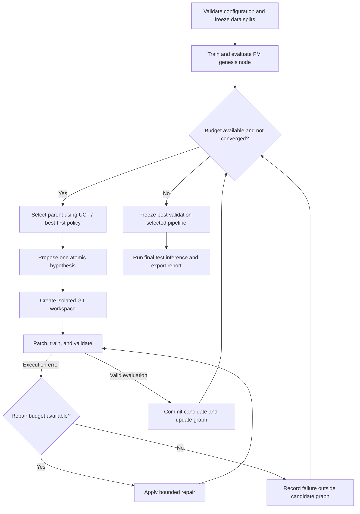

# Recommender Workshop

**Autonomous tree-search ML research for recommender systems.**

Recommender Workshop is designed to explore, optimize, and evaluate deep ranking pipelines on the **KuaiRand-Pure** short-video recommendation benchmark. It treats experimentation as a directed acyclic state graph: each accepted node is a runnable, evaluated pipeline pinned to a Git commit, and each edge records an atomic, hypothesis-driven change.

The goal is to automate the research loop—from feature engineering and model design to execution repair and final test inference—within a fixed experiment and time budget.

> **Status: partial implementation.** The FM workspace, subprocess runner, independent evaluation, and checkpoint recovery are implemented alongside the LLM, mutation, graph, memory, and Git components. The autonomous orchestration loop remains scaffolding. The starter-kit evaluation protocol has not been independently verified against an official benchmark.

## Research objective

Rank items within logged user impressions for the primary **`long_view`** target, improving over a fixed **Factorization Machine (FM)** reference baseline.

The project defines its primary validation objective as:

\[
\mathrm{Primary} = \frac{\mathrm{GAUC} + \mathrm{nDCG@5}}{2}
\]

| Constraint | Target |
| --- | --- |
| Dataset | KuaiRand-Pure |
| Primary prediction target | `long_view` |
| Reference model | Fixed FM baseline |
| Search budget | At most 50 candidate iterations |
| Wall-clock budget | At most 6 hours per end-to-end run |
| Convergence parameters | Improvement threshold ε = 0.002; patience N = 3 |
| Human intervention | None after configuration and launch |

The dataset release, label derivation, impression grouping, split boundaries, GAUC weighting, and nDCG eligibility rules must be fixed before experiments begin. The score above is the project's specified objective; equivalence to an official benchmark protocol remains to be verified.

## Architecture



### Evaluated pipeline graph

Each accepted node should retain its commit hash, parent reference, hypothesis, configuration, random seeds, validation metrics, resource usage, and artifact references. Edges identify the subsystem changed and the evidence motivating that change.

The tree registry retains pending, running, successful, failed, and pruned attempts. Only successful, unpruned pipelines are eligible for expansion. Failed attempts remain in the registry for budget and reward accounting without becoming eligible pipeline states. Valid candidates that underperform remain useful evidence, even when their branches are no longer expanded.

### Parent selection and pruning

The implemented **Upper Confidence Bound for Trees (UCT)** policy uses backed-up mean validation Primary plus `c * sqrt(log(parent_visits) / visits)`, with `c = sqrt(2)` by default. Each completed attempt backs up its absolute Primary along its lineage; failures back up zero. Genesis starts with zero visits and is excluded from the iteration budget. The implementation uses a single-parent tree and permits one active attempt at a time.

Selection expands a successful node until its child-attempt limit is reached (default three, including failures), then descends by UCT. Exhausted subtrees are skipped to backtrack. A successful candidate whose Primary drops by more than 0.01 relative to its parent is pruned; a failed candidate remains failed without pruning its parent. Pruning preserves history, and final best-pipeline selection includes evaluated pruned nodes. These settings are persisted in the tree checkpoint.

### Git isolation and persistent memory

Each candidate transformation runs on an ephemeral branch in an isolated workspace based on its selected parent's commit. Dataset splits remain read-only; checkpoints and other bulky artifacts live outside Git and are referenced by the experiment ledger.

Search state, failure caches, and cross-branch insights persist outside candidate workspaces. Hypothesis records should include their configuration and data context so that the agent can avoid repeating refuted experiments without incorrectly rejecting a hypothesis under materially different conditions.

`ExplorationMemory` in `agent/graph/memory.py` records terminal outcomes through `record(node, parent, context, stderr=..., reflection=...)`. Supply a `MemoryContext` with run ID, evaluation protocol ID, subsystem, and relevant configuration/shapes/seeds. Numeric gains and losses are relative to the parent; neutral results are retained, and pruning status does not determine whether an experiment improved. Terminal failures require an error signature and the final ten stderr lines. All terminal outcomes can carry optional reflections under 20 words, labelled as model interpretations without replacing numeric or error evidence. Memory never calls an LLM or applies reflection thresholds. The future orchestrator should gate reflection on significant parent-relative gains/losses or failures after repair exhaustion, subject to remaining budgets; pruning alone is not a trigger. Routine iterations need only numeric summaries. Diagnostic text should be redacted before it is supplied to memory or an LLM.

`prompt_summary(context)` selects up to six contextual insights with a 2,400-character cap, excludes other evaluation protocols, and deduplicates equivalent observations for the prompt without deleting evidence. Pass `max_tokens` and the target model's `token_counter` for a token cap on the complete summary. `save()` and `load()` use versioned `storage/global_insights.json` with atomic replacement and validation. Prompt assembly and recording remain explicit orchestrator responsibilities; they are not automatically wired into the mutation engine. Run offline checks with `python scripts/test_memory.py`.

### Improvement selection

`agent/improvement/` chooses one concrete change before code mutation. Categories
are not required. `ImprovementEngine.propose()` takes the current editable source
snapshot, the full genesis-to-current lineage (including edge diffs and results),
an objective, and frozen constraints. Optional context can include configuration,
sibling attempts, cross-branch memory, and remaining budgets. It returns a requirement
string directly consumable by `CodeMutationEngine`:

```python
from agent.improvement import ImprovementEngine
from agent.mutation.mutation import CodeMutationEngine

requirement = ImprovementEngine(client).propose(
    files,
    tree.get_lineage_chain(parent.node_id),
    objective="Improve validation Primary within the remaining experiment budget.",
    constraints="Keep data splits, target, metrics, and test isolation unchanged.",
    context=context_summary,
)
updated_files = CodeMutationEngine(client).mutate(requirement, files)
```

The caller supplies these variables and is responsible for source/commit
correspondence, context size, redaction, and budget enforcement. Proposal output
is validated structurally; its scientific merit and compliance still require
review/evaluation by the execution layer. Caller constraints are preserved in
the returned requirement. Neither proposal nor mutation executes code or writes
files. Autonomous orchestration remains unwired. Run offline checks with
`python -B scripts/test_improvement.py`.

### Bounded self-repair

Runtime exceptions, tensor shape mismatches, and CUDA out-of-memory errors trigger a bounded repair loop. Repairs and their outcomes are logged, and retries consume the same wall-clock budget as the rest of the run.

A candidate that exhausts its repair allowance is recorded as failed. Repair must not silently change frozen data splits, evaluation rules, or the primary target to obtain a passing run.

## Search space

| Subsystem | Candidate transformations |
| --- | --- |
| Feature engineering | Out-of-fold historical response rates, temporal features, and feature crosses |
| Model backbone | FM extensions, DeepFM, DLRM, and attention-based architectures |
| Multi-task learning | Auxiliary `click`, `like`, `comment`, and `play_time` signals supporting the `long_view` head |
| Loss formulation | Ranking-aware, listwise, and counterfactual objectives |

Each experiment should test one explicit hypothesis within a subsystem. Auxiliary labels and derived features require checks against the selected dataset schema. Counterfactual objectives require justified exposure or propensity assumptions; they should not be enabled solely because interaction logs are available.

## Evaluation and stopping protocol

1. **Freeze the benchmark.** Record the dataset version, split manifest, preprocessing rules, target definition, ranking groups, metric implementation, seeds, and hardware. Keep test data out of search decisions.
2. **Establish the reference.** Train and evaluate the fixed FM pipeline to create the genesis node. All candidates use the same evaluation protocol.
3. **Search on validation data.** Log both component metrics, Primary, the improvement over FM, execution status, and elapsed time for every evaluated candidate.
4. **Enforce all limits.** Stop when the iteration cap, wall-clock deadline, or convergence condition is reached, whichever comes first. Failed candidates count toward the iteration cap; repairs stay within their candidate's iteration and have a separate retry bound.
5. **Select and freeze.** Choose the best valid pipeline by validation Primary before accessing the test set. If no candidate improves on FM, retain the reference pipeline.
6. **Run final inference.** Export test predictions and, where labels are available, final test metrics without using them for further tuning.

**Implemented convergence interpretation:** compare best-so-far validation Primary now with its value three completed candidate iterations earlier. Stop if the total improvement across that window is at most 0.002; continuing requires strictly more than 0.002. Failed attempts count as iterations with no improvement. The comparison uses an absolute tolerance of 1e-12 at the threshold. Iteration and elapsed-time limits are independent stop conditions.

The six-hour budget covers initialization, baseline training, search, repairs, and final inference. The scheduler must reserve time for final inference and artifact export, and enforce timeouts on running jobs rather than checking the deadline only between experiments. If the run cannot complete, it must report that limitation explicitly.

## Planned run artifacts

- A searchable experiment ledger and pipeline graph with commit references.
- Per-candidate hypotheses, configurations, metrics, logs, and failure or repair histories.
- A persistent cache of prior hypotheses and cross-branch findings.
- The selected pipeline's configuration, checkpoint references, and test predictions.
- A final report comparing the selected pipeline with FM, documenting resource use, stopping reason, and reproducibility details.

## Implementation roadmap

- [ ] Specify and validate the KuaiRand-Pure data and metric contract.
- [x] Implement the fixed FM baseline and reproducible evaluation harness.
- [ ] Add the experiment ledger, pipeline graph, and Git workspace lifecycle.
- [ ] Implement parent selection, hypothesis generation, backtracking, and pruning.
- [ ] Add bounded execution repair, failure caching, and resource enforcement.
- [ ] Integrate feature, backbone, multi-task, and loss transformations.
- [ ] Implement convergence checks, final selection, test inference, and reporting.
- [ ] Validate a complete autonomous run under the 50-iteration and six-hour limits.

## Getting started

### Repository and workspace layout

```text
agent/
├── __init__.py
├── log.py                    # Shared structured storage/run_log.jsonl event logger
├── llm/
│   ├── __init__.py
│   ├── client.py              # LLM calls, token accounting, retries, model selection
│   └── mock_client.py         # Mock responses for offline testing
├── engine/
│   ├── __init__.py
│   ├── mutation.py            # Candidate diffs and bounded self-repair
│   ├── parser.py              # Search/replace and unified diff parsing
│   └── prompts.py             # Prompt templates and output format rules
├── graph/
│   ├── __init__.py
│   ├── node.py                # SearchNode, EdgeAction, MetricResult
│   ├── tree.py                # Selection, pruning, serialization
│   └── memory.py              # Insights and dead-end tracking
├── sandbox/
│   ├── __init__.py
│   ├── git_driver.py          # Inner repository lifecycle
│   ├── environment.py         # Candidate dependency environments and cache
│   ├── protocol.py            # Fixed data loader and evaluator access
│   ├── worker.py              # Isolated candidate entry point
│   └── runner.py              # Training and evaluation subprocesses
└── orchestrator.py            # Search loop and resource limits
workspace_template/           # Editable pipeline modules passed in LLM context
├── features.py               # Feature extraction, item/user stats, embedding encoders
├── model.py                  # Neural / tabular architecture (FM, DeepFM, DCN)
├── train.py                  # Training loop, optimizer, loss, checkpoint saving
├── config.py                 # Hyperparameters: learning rate, batch size, embedding dims
└── requirements.txt          # Candidate's pinned runtime dependencies
workspace/                    # Ignored independent Git repo; same pipeline filenames
storage/                      # Ignored persistent outputs; .gitkeep is tracked
├── state_tree.json
├── run_log.jsonl
└── global_insights.json
data/kuairand-pure/            # Existing data layout preserved
├── starter-kit/              # Tracked fixed reference code and English README
└── KuaiRand-Pure/data/        # Ignored raw dataset; download separately below
checkpoints/                  # Ignored weights and predictions; .gitkeep is tracked
requirements.txt              # Agent/runner dependencies, not the candidate environment
main.py                       # Planned CLI entry point
README.md
```

The outer repository versions the agent and starting template. The inner `workspace/` repository versions evolving candidate pipelines independently; it is not a submodule and its files are not tracked by the outer repository.

`GitDriver(workspace_dir="workspace").init_workspace("workspace_template")` copies the template into a new workspace, initializes its Git repository, and creates the `node_00: genesis` scaffold commit. It returns the current commit SHA. That commit is not an evaluated search node until the baseline has run successfully. Subsequent runs resume the existing workspace without overwriting files or resetting its history. A populated directory that is not an initialized workspace is reported rather than silently replaced. Template updates apply only to newly initialized workspaces. The driver copies all template files, including `baseline.py` when supplied by a starter kit, excluding Git metadata.

The driver uses the Git CLI through Python's `subprocess` module; Git must be installed and available on `PATH`, but GitPython is not required. It supports detached checkouts, branches rooted at explicit parent commits, UTF-8 source reads and atomic per-file writes, node commits, and unified diffs. Call `reset_hard()` and `clean_untracked()` explicitly before switching when edits should be discarded; ignored files are preserved by cleanup. Git failures propagate as `subprocess.CalledProcessError` with captured stderr. Run the isolated integration checks with `python scripts/test_git_driver.py`.

The editable template contains `features.py`, `model.py`, `train.py`, `config.py`, and `requirements.txt`, intended to be passed in LLM context together. They implement the reference FM and declare its dependencies. The module specifications are authoritative; implementations and dependency choices are replaceable. Fixed data loading and scoring are accessed through `agent/sandbox/protocol.py`, outside the editable pipeline; the agent must not evolve the benchmark scoring rules. The template contains no data, checkpoints, virtualenv, or Git metadata. Runtime storage files are ignored by the outer repository.

The root research CLI is not runnable yet. The runner can be invoked independently as described below.

### Train, evaluate, and recover a candidate

Install the root `requirements.txt` for the agent/runner, then run from the repository root.
The runner provisions a separate candidate environment on first use:

```powershell
python -B -m agent.sandbox.runner --workspace workspace_template --data-dir data/kuairand-pure/KuaiRand-Pure/data --config '{"epochs":3}' --timeout 180
```

Each invocation defaults to a fresh UUID-named checkpoint under `checkpoints/`.
The JSON result supplies its absolute `checkpoint_path` and `artifact_dir`.
To resume a failed attempt, repeat the command with `--checkpoint <that-path>`
and exactly the same configuration, workspace source, train/validation data, and
dependency environment (including Python/platform and installed package versions).
Completed training is a no-op when resumed. Corrupt or incompatible checkpoints
fail without being overwritten; there is no implicit warm start or automatic retry.

To run final test inference explicitly, use:

```powershell
python -B -m agent.sandbox.runner --workspace workspace_template --data-dir data/kuairand-pure/KuaiRand-Pure/data --checkpoint <that-path> --inference-only --split test
```

Validation is the default; test labels are never sent to training or prediction.
The fixed loader uses the starter-kit date boundaries and native `long_view`.
Scoring groups impressions within each user, uses positive-count-weighted GAUC,
and averages nDCG@5 across users including those without positives. This is the
supplied starter-kit protocol, not a claim of official benchmark equivalence.

The Python API supports preloaded seven-column splits as well:

```python
from agent.sandbox.runner import Runner

runner = Runner(storage_dir="storage/runs", checkpoint_dir="checkpoints")
result = runner.run("workspace_template", data_dir="data/kuairand-pure/KuaiRand-Pure/data",
                    overrides={"epochs": 3}, timeout_s=180)
if result.status == "success":
    print(result.metrics)  # MetricResult for validation; None for test results
else:
    print(result.error, result.artifact_dir, result.checkpoint_path)
```

`splits={"train": rows, "valid": rows, "test": rows}` may replace `data_dir`.
Rows are `(date, user_id, video_id, author_id, tab, duration_ms, long_view)`;
prediction receives only the first six fields. Caller-supplied splits must obey
the frozen experiment protocol; the runner does not repartition them.

Workspace contract:

- `config.resolve(overrides)` merges explicit overrides over defaults and validates them.
- `features.fit(train_rows)` learns duration quantiles and five categorical vocabularies;
  `transform(rows, state)` preserves order and maps unseen categories to per-field UNK slots.
- `train.train(train_rows, valid_rows, checkpoint_path, overrides, context)` trains and saves.
  It uses the fixed evaluator for best-checkpoint selection and early stopping.
- `model.load_predictor(checkpoint_path)` returns an object with `predict(rows)`.
  A separate worker loads the artifact without training; the runner independently
  validates score count/finiteness and computes metrics against withheld labels.

The single pickle checkpoint contains format version, effective configuration,
fitted features, best inference weights, best epoch, latest validation metrics,
and resume state: latest weights, Adam moments/step, completed epoch, shuffle RNG,
best score, and patience counter. It also records hashes of workspace Python
source, training/validation rows, and fixed protocol source. Each completed epoch
is saved to a unique temporary file, flushed, then atomically replaced. Recovery
replays work since the last completed epoch; it is not mid-batch recovery.
The checkpoint context also contains the candidate environment identity and
installed-package snapshot. Checkpoints from before environment tracking cannot
be exact-resumed under the new contract; there is no silent compatibility bypass.

Each attempt stores `result.json` (including checkpoint hash and execution context),
training/prediction stdout and stderr logs, and successful `predictions.npy` in
input order. Failure/timeout results have no metrics. Test scores are available
in `result.scores` but never represented as validation `MetricResult` objects.

The timeout is shared by environment creation/installation/verification and the
training and inference subprocesses. Data loading,
serialization, and fixed scoring count toward elapsed time but are synchronous,
so they may overrun the deadline before returning a timeout. The runner terminates
the direct worker on timeout, not arbitrary descendant processes. This is process
isolation, **not an OS security sandbox**: run only trusted candidate code and
trusted pickle checkpoints. Concurrent writers to the same checkpoint are unsupported.

### Candidate dependency environments

The root environment runs the agent, data loader, and authoritative evaluation.
It includes NumPy for raw loading and prediction artifact handling. The workspace
independently declares NumPy for the reference FM; candidates do not inherit the
agent's installed packages. The worker transport and fixed evaluator are
standard-library-only, so non-NumPy candidate implementations can omit NumPy.

`workspace_template/requirements.txt` is a flat version lock. Include **all**
runtime dependencies, including transitives, as exact `name==version` pins.
Comments and blank lines are allowed; includes, options, URLs, editable installs,
extras, markers, ranges, and source distributions are intentionally unsupported.
The runner installs wheels with `--no-deps` and then runs `pip check`; missing
transitive pins fail instead of being silently resolved. This is a version lock,
not a hash-verified artifact lock. Packages must be trusted, and a wheel must be
available for the selected Python/platform. The reference pins NumPy 2.5.2.

The runner owns cached virtualenvs under ignored `storage/environments/`, outside
the workspace. Cache keys include the complete dependency declaration (comments
included), Python version/implementation/ABI, platform, and provisioning policy.
Matching candidates reuse the environment without reinstalling. A readiness
manifest is published only after successful installation; failed owned builds
are removed when possible. Cleanup failures (for example, locked Windows DLLs)
are logged with the leftover directory without masking the original error.
An incomplete cache left by a killed runner or failed cleanup is rejected, not reused;
after confirming no process is building it, remove that specific cache directory
before retrying. Concurrent first-time creation of the same key fails clearly.

Before reuse and after successful worker execution, the runner checks runtime
identity and installed distribution names/versions against the manifest. Drift
fails the attempt; cached environments are never silently upgraded or repaired.
Candidates must not modify shared environments. These checks do not hash every
installed file and do not make candidate code a security sandbox.

Every attempt records the dependency declaration, environment manifest (including
interpreter path and installed packages), and environment stdout/stderr logs.
Training and prediction run under that virtualenv's Python with isolated imports,
not the root Python. `Runner(python=...)` selects the bootstrap Python version,
not an escape hatch to run candidates in the agent environment.

Use `Runner(environment_dir=..., wheelhouse=...)` or CLI `--environment-dir` and
`--wheelhouse` to customize storage or supply an offline wheel directory.
With `--wheelhouse`, the package index is disabled. Otherwise initial provisioning
may access the default pip index; there is no separate dependency-install timeout
outside the candidate budget. Existing initialized workspaces are not overwritten:
add and commit their own `requirements.txt` explicitly before using this runner.

### Shared run event log

`agent/log.py` provides `RunLogger`, which appends structured UTF-8 records to
`storage/run_log.jsonl`. Runner start/completion and environment creation/reuse,
build failures, and cleanup warnings share the attempt's `run_id`. Each record
contains `schema_version`, UTC `timestamp`, `level`, `component`, `event`, `run_id`,
and a `data` object. Artifact paths link events to detailed per-attempt logs;
raw subprocess output, credentials, and unredacted exception messages are not
copied into the shared log.

```python
from agent.log import RunLogger

logger = RunLogger()  # Defaults to storage/run_log.jsonl
logger.emit("search.started", component="orchestrator", run_id="search-001")
```

Use `Runner(log_path=...)` or CLI `--log-path` to choose another destination.
Logging is best-effort: `emit` returns `False` and writes a minimal stderr notice
if serialization or writing fails, without replacing the original task error.
Appends are thread-safe within one parent agent process; separate independent
agent processes should use separate log paths. This is a diagnostic event log,
not a transactional or crash-durable experiment ledger. Candidate processes keep
using stdout/stderr, which the runner persists separately.

Checks:

```powershell
python -B scripts/test_runner.py
python -B scripts/test_environment.py
python -B scripts/test_log.py
python -B scripts/test_runner.py --real-data
```

The runner suite checks exact starter-FM predictions, metric agreement within
1e-6 (NumPy label types cause tiny rounding differences), read-only inference,
fresh artifact paths, process-crash recovery equal to uninterrupted training,
failed atomic saves, compatibility checks, timeouts, and malformed predictions.
Its first run may install the pinned FM dependencies; set `RUNNER_TEST_WHEELHOUSE`
to a local wheel directory for offline provisioning. Environment tests build a
tiny local wheel and need no package index: they cover isolation, cache reuse,
dependency-key changes, drift rejection, install failures, and a non-NumPy candidate.
The optional raw-data smoke test uses only the first 10,000 rows per split and
three epochs; its scores are not full-benchmark results.

Local verification on 2026-08-30 also completed three epochs on the full raw
training split with default FM settings: validation GAUC 0.664194, nDCG@5
0.534426, Primary 0.599310 (124,909 rows), in 20.1 seconds including loading and
evaluation. Independent test inference from that checkpoint yielded GAUC
0.657770, nDCG@5 0.526752, Primary 0.592261 (170,588 rows). These are a runner
verification run, not converged FM or autonomous-search benchmark results.
Repeating the full three-epoch run in the managed candidate environment reproduced
the same validation and test scores; that environment contained only NumPy 2.5.2
and bootstrap pip, with no agent/LLM dependencies.

### Download KuaiRand-Pure

The raw dataset is not included in Git. Run these PowerShell commands from the project root to download the [KuaiRand-Pure archive from Zenodo](https://zenodo.org/records/10439422/files/KuaiRand-Pure.tar.gz), verify its MD5, and extract it into the expected folder:

```powershell
New-Item -ItemType Directory -Force data/kuairand-pure | Out-Null
python -c "import urllib.request; urllib.request.urlretrieve('https://zenodo.org/records/10439422/files/KuaiRand-Pure.tar.gz', 'data/kuairand-pure/KuaiRand-Pure.tar.gz')"
if ($LASTEXITCODE -ne 0) { throw 'Dataset download failed' }
if ((Get-FileHash data/kuairand-pure/KuaiRand-Pure.tar.gz -Algorithm MD5).Hash -ne '0820331067a3784d9691136f772b35a7') {
    throw 'Dataset MD5 mismatch; download the archive again before extracting'
}
tar -xzf data/kuairand-pure/KuaiRand-Pure.tar.gz -C data/kuairand-pure
if ($LASTEXITCODE -ne 0) { throw 'Dataset extraction failed' }
```

The six CSV files will be in `data/kuairand-pure/KuaiRand-Pure/data/`. Both the archive and extracted dataset are Git-ignored. When running the reference scripts from `data/kuairand-pure/starter-kit/`, pass `--data_dir ../KuaiRand-Pure/data`; see the [starter-kit README](data/kuairand-pure/starter-kit/README.md) for baseline commands.

### LLM client setup and smoke test

Use Python 3.10 or newer for the client. Install dependencies from the project root:

```powershell
python -m pip install -r requirements.txt
```

For a fresh clone, copy `.env.example` to `.env` (do not overwrite existing credentials). Set `LLM_MODEL` to your provider/model identifier and replace `<YOUR-API-KEY>` in `LLM_API_KEY`. Optionally set `LLM_API_BASE` for a custom endpoint. `.env` is Git-ignored. Existing process environment variables take precedence over the file. No default model is selected because the correct model and provider depend on your key.

The client uses [LiteLLM's provider translation](https://docs.litellm.ai/docs/completion/input). Model identifiers use provider prefixes such as `anthropic/`, `gemini/`, `openrouter/`, `openai/`, or `ollama_chat/`. For local providers without authentication, leave the key blank. Providers using cloud credentials may require additional provider-specific environment configuration.

```powershell
# Offline tests: no dependencies, credentials, network requests, or token spend.
python scripts/test_llm.py

# Live smoke test: sends a small request using your .env settings; may incur charges.
python scripts/test_llm.py --live
```

```python
from agent.llm.client import LLMClient

client = LLMClient.from_env()
result = client.complete([
    {"role": "system", "content": "Be concise."},
    {"role": "user", "content": "Suggest one ranking experiment."},
])
print(result.text)
print(result.usage)
print(client.total_usage)
```

`complete(messages)` is the single completion interface for both the real and mock clients. It accepts text chat messages and supports a per-call model and output-token limit override. Create a separate client when changing provider credentials or endpoint. This initial interface is synchronous and text-only, without streaming or tool calls.

The wrapper retries transient failures with bounded exponential backoff and jitter, but does not retry authentication or invalid-request failures. `LLM_MAX_RETRIES` counts retries after the first attempt; `LLM_TIMEOUT` is per attempt, not a global research deadline. The future orchestrator must enforce the overall run budget. Usage totals count returned provider-reported tokens only, not potentially billed failed requests; missing usage is explicitly represented by `None`. Raw provider exception messages are not included in wrapper errors.
